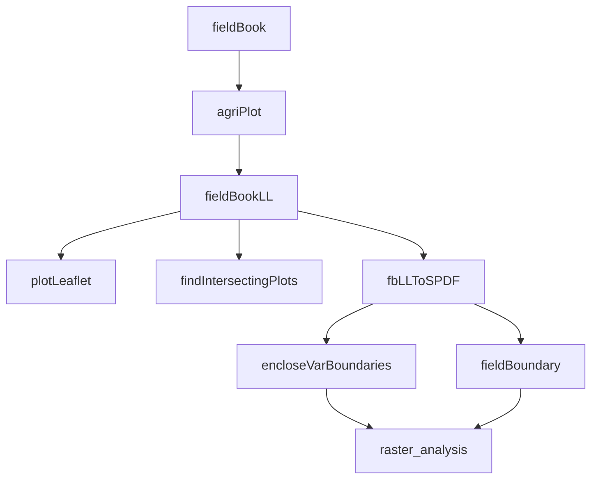

 # agriPlot  

agriPlot is a suite of practical geospatial tools for agricultural field research planning and analysis

## What is agriPlot?

The core R function of agriPlot (i.e. agriPlot) takes a fieldbook that is comprised of an agricultural research experiment and computes longitude and latitude coordinates for each individual plot. Once geographical coordinates are assigned to individual plots, the primary utility of agriPlot is to provide users with straight-forward functions for geospatial visualization and analyses of a field experiment. For instance, let's say you're planting a trial at a new site. agriPlot can help users vizualize various placements of a field trial to identify an ideal planting area and assess the spatial design. Additionally, users can generate a map to help ground truth field boundaries. agriPlot even has functions to help with more complicated tasks such as accurately planting border/filler in pivot tracks. To best visualize the various outputs of agriPlot, I highly recommend using open-source GIS software such as QGIS. agriPlot does **NOT** design agricultural field experiments. That’s left up to the user.

## What is a fieldbook?

A fieldbook represents some agricultural field research experiment wherein the row and column for every plot has a corresponding treatment and/or test and may also contain any other important attribute. agriPlot should be able to accept any agricultural field research design (i.e. randomized complete block, incomplete block, augmented design, etc.) so long as each plot has a row and column value. 

## Accuracy

The analysis performed by all the functions is accurate. However, when using this program, it should be important that results are ground-truthed before final implementation of a field trial design. 

## Documentation

Primary Workflow 




#### <u>fieldBook input:</u>

Your fieldbook input can have any number of attributes but there are a handful of header names that are **essential** for agriPlot to work. Please see agriPlot_fb_sample.csv as an example fieldbook in the Sample_data folder. 

plotRowNum: contains your fieldbook row numbers associated with each respective plot. Must be an integer.

- Rows always go in the **Latitudinal** or **Y** direction

plotColumnNum: contains your fieldbook column numbers associated with each respective plot. Must be an integer. 

- Columns always go in the **Longitudinal** or **X** direction

plotRows: this is the number of rows per plot. This might be a 2-row, 4-row or 6-row plot, etc. A fieldBook can have multiple plotRows. 

testName: corresponding name of the test associated with the plot you're evaluating. Please don't allow for any whitespace in the testName. Can be numeric, character or alphanumeric. 

repNum: the replication number associated with the testName (i.e. 1,2,3). Must be an integer. 

block: block associated with each testName.

id: unique identifier for each plot. Can be numeric, character or alphanumeric (i.e. 101,102,103 or plot101,plot102,plot103)

#### <u>argiPlot</u>

**Description**

agriPlot is the core function that serves as input for all of the other functions outlined here. The input is a user fieldBook with specified header names. Users just have to enter a handful of inputs and agriPlot.R will output a latitude and longitude for each plot in your fieldBook. This output will be referred to as fieldBookLL.  

**Libraries**

library(data.table), library(plyr)

**Usage**

```R
agriPlot(fieldBook,initialLong,initialLat,rowSpacing,plotLength,rowColDir,plantingAngle)
```

**Arguments**
fieldBook: either data.frame or data.table. fieldBook must have necessary header names.
initialLong: the Longitude for the plot in column 1 and row 1.
initialLat: the Latitude for the plot in column 1 and row 1.
rowSpacing: this is the row spacing of your planter in **meters** (15 inch planter spacing = 0.381 meters, 30 inch planter spacing = 0.762 meters).  
plotLength: this is the <u>**total**</u> length of your plot in **meters**. This includes the planted portion of the plot and the alley (if an alley is applicable).
rowColDir: this is the row and column orientation of your field.This is probably the most confusing part of the function, but let me explain.

For North/South plantings:
The first two letters before the hyphen represent the row direction in which your row numbers are increasing. The second two letters following the hyphen represent represent the column direction in which your column numbers are increasing. There are one of four North/South planting inputs to choose from.

- SN-WE – row numbers increase from South to North and column numbers increase from West to East
- SN-EW – row numbers increase from South to North and column numbers increase from East to West
- NS-WE – row numbers increase from North to South and column numbers increase from West to East
- NS-EW – row numbers increase from North to South and column numbers increase from East to West 


For East/West plantings:
The first two letters before the hyphen represent the column direction in which your column numbers are increasing. The second two letters following the hyphen represent represents the row direction in which your row numbers are increasing. The are one of four East/West inputs to choose from.

- WE-SN – column numbers increase from West to East and row numbers increase from South to North
- WE-NS – column numbers increase from West to East and row numbers increase from North to South
- EW-SN – column numbers increase from East to West and row numbers increase from South to North
- EW-NS – column numbers increase from East to West and row numbers increase from North to South


plantingAngle: The angle you planted at. Values greater than 0 rotate your field in a counterclockwise direction and values less than 0 rotate your field in a clockwise direction. If you planted "perfectly" vertical or horizontal then your plantingAngle is 0. I recommend using calcPlantingAngle.R to find your planting angle if you don't know it. 

Examples:

```R
fbLL <- agriplot(my2021FieldBook,-98.13135,40.89407,0.762,4,"WE-NS",0)
```

Example agriPlot output with Long/Lat computed for each plot. Point coordinates representing each plot within a fieldBook were plotted in QGIS with a satellite imagery base layer. With QGIS a user can nicely visualize how their field trial is positioned in a field. 


#### <u>calcPlantingAngle</u>:

**Description**

Calculates planting angle based on an initial longitude and longitude, terminal longitude and latitude, direction of rotation and planting direction.

**Usage**

```R
calcPlantingAngle(LongLat1,LongLat2,rotation,plantingDir)
```

**Arguments**

LongLat1: this is the initial longitude and latitude of where you plan to begin planting. Values should be stored as c(-98.1878745,40.8915224). 

LongLat2: the is the terminal longitude and latitude for where your first planting row will end. Values should be stored as c(-98.1878745,40.8915224).

rotation: direction you will be rotating field. There are one of two inputs to select from (arguments must be in quotes):

* "cw" - clockwise
* "ccw" - counter-clockwise

plantingDir: the direction you will be planting. There are one of two inputs to select from. 

* "N/S" - north/south planting direction
* "E/W" - east/west planting direction

**Example**

```R
calcPlantingAngle(c(-98.1878745,40.8915224),c(-98.1846696,40.8909628),"cw","E/W")
```

#### <u>demoFieldBook</u>:

**Description**
    Generates a simple "demo" fieldbook from a specified number of rows, columns and plot rows. In 	some instances a user may not have a fieldbook quite yet prepared for the season but still may want the option for a preliminary visualization their field trial layout. The output of this function is only intended to be used with agriDemoplot (explained after this function).

**Libraries**

library(data.table), library(plyr)

**Usage**

```R
demoFieldBook(beginRow,endRow,beginColumn,endColumn,plotRows)
```

**Arguments**

beginRow: the row value you start at. Must be an integer.
endRow: the row value you end at. Must be an integer.
beginColumn: the column value you start at. Must be an integer.
endColumn: the column value you end at. Must be an integer.
plotRows: number of plots per row associated with the specified rows and columns. Must be an integer.

**Examples**

```R
demoFB <- demoFieldBook(1,50,1,18,2)
```

Multiple plotRows:

```R
demoFBList <- list(A=demoFieldBook(1,50,1,6,2),B=demoFieldBook(1,50,7,12,4),C=demoFieldBook(1,50,13,18,2))
demoFB <- do.call(rbind,demoFBList)
```

#### <u>agriDemoPlot</u>

**Description**

agriDemoplot is virtually the same function as agriPlot, however, it's only meant to take a fieldbook generated from demoFieldBook as input. agriDemoplot can take the output from demoFieldBook as is. To limit redundancy in the README please refer agriPlot for explaination of the agruments. 

**Libraries**

library(data.table)

**Usage**

```R
agriDemoPlot(fieldBook,initialLong,initialLat,rowSpacing,plotLength,rowColDir,plantingAngle)
```

**Examples**

```R
demoFBList <- list(A=demoFieldBook(1,50,1,6,2),B=demoFieldBook(1,50,7,12,4),C=demoFieldBook(1,50,13,18,2))
demoFB <- do.call(rbind,demoFBList)
demoFBLL <- agriDemoPlot(demoFB,-98.13135,40.89407,0.762,4,"SN-WE",0)
```

#### <u>plotLeaflet</u>

**Description**

plotLeaflet is a simple function that takes an fieldBookLL (i.e. output of agriPlot) and plots the latitude and longitude points against a satellite imagery layer using Leaflet. This function is meant for quick and easy viewing of your plot points.

**Libraries**

library(leaflet)

**Usage**

```R
plotLeaflet(fieldBookLL)
```

**Arguments**

fieldBookLL: fieldBook with Latitude and Longitude for plots 

**Example**

```R
leafletPlot <- plotLeaflet(fieldBookLL)
leafletPlot
```

Example output:


#### <u>pivotTracksLL</u>

**Description**

This function takes the radius of each center pivot track, the Longitude and Latitude of the center pivot and calculates latitude and longitude points for each respective track. Assumes center pivot is a 360 degree circle. Can be used as input for findIntersectingPlots to determine which plots intersect with pivot tracks.

**Libraries**

library(foreach)

**Usage**

```R
pivotTracksLL(radin, cpLong, cpLat)
```

**Arguments**

radin: is the radius of each pivot track in <u>**meters**</u>. Values can be stored using e.g.: c(54.577,103.475,152.119,200.906,263.136,325.574,387.55) where each comma separated value represents a track radius. Radius measurements for radin should be taken as close as possible to the center of the pivot stop and to the end of each respective track. 
cpLong: This is longitude coordinate for the center pivot. Should be taken right at the very center of the pivot stop. 
cpLat: This is latitude coordinate for the center pivot. Should be taken right at the very center of the pivot stop.

**Examples**

Output pivot tracks:

```R
pivLL <- pivotTracksLL(c(55,109.5,163.249,217.919,272.5,326.718),-96.45504366,41.18194751)
```

Example output of pivot track point coordinates (in green) plotted using QGIS 


#### <u>findIntersectingPlots.R</u>

**Description**

findIntersectingPlots.R takes a fieldBookLL (i.e. output from agriPlot) and a given set of coordinates (i.e. pointsOfInterest) and outputs intersecting plots at a user-specified distance. 

**Libraries**

library(raster)

**Usage**

```R
findIntersectingPlots(fieldBookLL,pointsOfInterest,distance)
```

**Arguments**

fieldbookLL: agriPlot fieldBook output with Longitiude and Latitude for each plot 
pointsOfInterest: Longitude and Latitude coordinates for points of interest. Input should be dataframe or matrix. 
distance: the distance threshold in **meters** for where a plot intersects with a points of interest. Plots that have a distance less than the threshold are output as intersecting.

**Examples**

Basic usage:

```R
fbLLintersection <- findIntersectingPlots(fbLL,pivotLL,3)
```

For starters, any set of pointsofInterest can be used. But in the following example we'll demonstrate how to use the function to find plots that intersect with pivot tracks. This is useful for mapping border plots into pivot tracks. **Note, if you shift your field trial in any direction, you need to be aware that plot intersections may change as well!!!** So if you're doing this in practice you should add a little extra border in pivot tracks based on the intersections for good measure to allow for any minor adjustments during planting. 

```R
agD <- demoFieldBook(1,60,1,37,4)
agDLL <- agriDemoPlot(agD,-96.4535927,41.1819774,0.762,4,"SN-WE",0)
pivLL <- pivotTracksLL(c(55,109.5,163.249,217.919,272.5,326.718),-96.45504366,41.18194751)
myInt <- pivotPlotsIntersection(agDLL,pivLL,3)
```

Pivot tracks (in green), fieldBook plots (in brown) and plots intersecting with pivot tracks (in red)


Plots intersecting with pivot tracks:


In the following example, maybe you've mapped a drainage pattern (in pink) and would like to plant a border in that area. 


Intersecting plots:


#### <u>fbLLToSPDF.R</u>

**Usage**

```R
fbLLToSPDF(fieldBookLL,coordRefSys)
```

**Description**
This function takes a fieldBookLL and converts it to a Spatial Points Data Frame (i.e.SDPF) using the library spatial points. This is an important transition in the workflow as the fieldBook is now a spatial object. This allows for more advanced spatial analysis/operations to be exectuted with libraries such as raster, rgeos, etc. 

**Libraries**

library(sp)

**Arguments**

fieldBookLL: agriPlot.R fieldBook output with Longitiude and Latitude for each plot
coordRefSys: this the coordinate reference system (CRS) you wish to assign to your Spatial Points Data Frame. 

Using coordRefSys = "default" sets the CRS to:

 	"+proj=longlat +ellps=WGS84 +datum=WGS84 +no_defs"

Otherwise, users can enter any valid CRS.

**Examples**

```R
myfbSPDF <- fbLLToSPDF(my2021FBLL,coordRefSys="default")
```

Example using other CRS:

```R
myfbSPDF <- fbLLToSPDF(my2021FBLL,coordRefSys="EPSG:3857") # WGS84 / Psuedo-Mercator
```

#### <u>fieldBoundary.R</u>

**Description**

This function takes a fieldBook Spatial Points Data Frame and computes a rectangular polygon that encloses all fieldBook plot points.

**Libraries**

library(sp), library(rgeos)

**Usage**

```R
fieldBoundary(fieldBookLLSPDF)
```

**Arguments**

fieldBookLLSPDF: fieldBook Spatial Points Data Frame

**Examples**

Basic:

```R
fbBoundary <- fieldBoundary(fbSPDF)
```

Additional examples:

```R
read.csv <- "agriPlot_fb_sample.csv"
sampleNLL <- agriPlot(sample,-96.4106204,41.1467745,0.762,4,0,"SN-WE")
fbSPDF <- fieldBookLLToSPDF(agDLL, coordRefSys = "default")
fbBoundary <- fieldBoundary(fbSPDF)
#write shapefile
shapefile(fbBoundary,"myfieldboundary")
```

Plot boundary using "plot" in R. 

```R
plot(fbBoundary,axes=TRUE)
```

The figure shown here is a rectangular polygon field boundary that encloses all plots. The output from this function can also be used as a masking layer for a raster input.    


```R
#add plot points
points(fbBoundGeom,cex=0.25)
```

Field boundary with plot points.


The figure below is the vector shapefile output in QGIS. Further uses might include exporting a KML file from QGIS and loading it into a GIS iPhone/Android application to take to the field. Notes: since this boundary only encloses single points representing plots, the area will be slightly smaller than the actual field area. If you want to account for the entire plot dimensions see agriPlotDim.  


#### <u>encloseVarBoundaries</u>

**Usage**

```R
encloseVarBoundaries(fieldBookLLSPDF,feature)
```

**Description**

This function computes a polygon boundary that encloses each unique variable  (i.e. testNoRep or block). Simply put, if you want a polygon boundary for each variable associated with a specific header name, this is the function to do it. The output of this function is a SpatialPolygonsDataFrame. The names features of the SpatialPolygonsDataFrame are called "blocks".

**Libraries**

library(sp), library(rgeos)

**Arguments**

fieldBookLLSPDF: fieldBook as Spatial Points Data Frame

variable: variable with elements to enclose

**Example**

```R
myBlocks <- encloseVarBoundaries(fieldBookLLSPDF,"testNoRep")
```

Below we'll use "agriPLot_fb_sample.csv" as an example to further demonstrate this function.

```R
myFb <- read.csv("agriPLot_fb_sample.csv")
myFBLL <- agriPlot(sample,-96.4944759,41.1636251,0.762,4,"SN-WE",0)
mySPDF <- fbLLToSPDF(myFBLL,"default")
#important step: remove filler/border plots!!!
mySPDFNoB <- fbSPDFRemoveBorder(mySPDF,"Border")
myTests <- encloseVarBoundaries(mySPDFNoB,"testNameRep") #bound with "testNoRep"
#write shapefile
shapefile(myTests,"myTests")
#plot result in R
plot(myTests, asp=-1,axes=TRUE)
#Note! In order to add text to the map you must use "blocks"
text(myTests,"blocks",cex=0.5)
```

In the figure below, the plots associated with each test are enclosed in their own repsective polygon. This is one method for a nice visualization of a field trial layout. The output from this function can also be used as a masking layer for a raster input.    


Shapefile vector in QGIS:


#### <u>agriPlotDim</u>

**Description**

Displaying a plot as one point has some shortcommings because it doesn't account for the entire dimensions of a plot. If this is of interest, users can compute a longitude and latitude for all four corners of a plot's dimensions using agriPlotDim.R. The output from agriPlotDim would represent the most accurate field boundary as it accounts for plot dimensions. It should be noted that the output of this function only contains the following headers: id, block, plotRowNum, plotColumnNum, plotRows, testNameRep, Longitude, Latitude.

**Usage**

```R
agriPlotDim(fieldBookLL,buffer)
```

**Arguments**

fieldBookLL: fieldbook output from agriPlot with longitude and latitude for each plot
buffer: plot dimension multiplier from 0 < 1. You can think of this as how much of the plot dimensions do you want to include. A value of 1 would be the entire plot dimensions. I might recommend using 0.8 to roughly account for the alley space of a plot. 

**Examples**

```R
myFBDim <- agriPlotDim(fbLL,0.8)
```

In the following example I'll demonstrate how you can visualize plots using agriPlotDim and passing it through the elementBoundaries function to generate individual plots. 

```R
myFb <- read.csv("agriPLot_fb_sample.csv")
myFBLL <- agriPlot(myFb,-96.4944759,41.1636251,0.762,4,"SN-WE",0)
myFBDim <- agriPlotDim(fbLL,0.8)
dimSPDF <- fbLLToSPDF(apLLBuff,"default")
plotBounds <- elementBoundaries(dimSPDF,"id")
plot(plotBounds)
```

In the figure below, each rectangle represents a plot in the fieldBook with it's repsective dimensions. 


Plot bounds in QGIS:


#### Additional examples and geospatial analysis: 

The following examples demonstrate how you can utilize your fieldBoundary or elementBoundries as a masking layer to extract information from a raster dataset. In this instance, we'll be using an EC (i.e. apparent soil electrical conductivity) map* for a field as our input raster. However, any raster dataset (e.g. NDVI, yield map, etc.) could be used.

EC Deep map:

```R
myECD <- raster("ECDeep.tif")
plot(myECD,axes=TRUE)
title("EC Deep (mS/m)")
```


Add boundary for fieldBook (i.e. output from fieldBoundary):

```R
plot(myFieldBoundary,add=TRUE)
```


Mask raster with field boundary layer:

```R
fieldMask <- mask(myECD,myBounds)
plot(fieldMask,axes=TRUE)
plot(myBounds,add=TRUE)
```


```R
plot(myTests,asp=-1,axes=TRUE)
plot(fieldMask,add=TRUE)
plot(myTests,add=TRUE)
text(myTests,"Blocks",cex=0.5)
title("EC Deep (mS/m) and Field Tests")
```

In this figure we have individual test boundaries overlayed on our EC Deep map. More than anything, it's a nice soil EC map that displays spatial variability across a field trial. If you had drone NDVI imagery, the same steps/concept would apply here as well. 


**Make a raster plot with yield data**

Let's say it is the end of the season and you have yield values for all of your plots. We can rasterize the yield data to make a simple yield map of the field. By rasterizing the dataset we're taking discrete point values, in this case yield, and converting it to a continuous geospatial value. I'll be using the file agriPLot_fb_samplev2_yield.csv as an example. A map like this is probably only useful for visualization of any spatial variability in the field. For instance, maybe you had a pest or weed issue or poor irrigation uniformity and wanted to see if these events contributed to any broad spatial differences in yield across the field.  

```R
fbYield <- read.csv("agriPLot_fb_samplev2_yield.csv")
myFBLL <- agriPlot(fbYield,-96.4944759,41.1636251,0.762,4,"SN-WE",0)
myFBLLSPDF <- fbLLToSPDF(myFBLL,"default")
#remove border, it's just easier and you probably don't care about the yield anyways
myFBLLSPDFNOB <- fbSPDFRemoveBorder(myFBLLSPDF,"Border")
#this next steps generates a raster with empty cells and it's bounds are the myFBLLSPDF
#ncol and nrow is the number of columns and rows in your fieldbook
r <- raster(myFBLLSPDFNOB, ncol=58,nrow=64, crs="+proj=utm +zone=18 +datum=WGS84 +units=m +no_defs")
#rasterize Yield data 
YieldRas <- rasterize(myFBLLSPDFNF,r,'Yield')
plot(YieldRas)
title("Yield Raster (Bu/A)")
```


*EC Data from: Application of Manifold GIS Software for Precision Agriculture Viacheslav I. Adamchuk and Abbas Hemmat 
